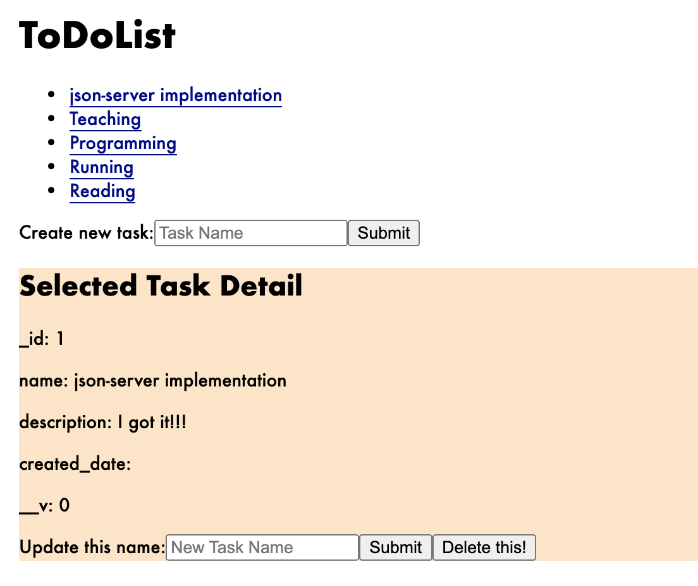

# ToDoList-Web-Native-API-DB
To Do List Application: Web app, Native app, API, DB.

## 内容
- ToDoリストのアプリケーション
  - 環境: Dockerによる仮想環境
  - ブラウザアプリ: React.js, TypeScript, Webpack + Babel
  - ネイティブアプリ: Swift(iOS) & Kotlin(Android)
  - API: Node.js, Express, JavaScript TypeScript, Webpack + Babel
  - データベース: MongoDB

## プロジェクトの実行方法
1. dockerイメージを作成（```docker-compose build```）
1. dockerコンテナの起動（```docker-compose up```）
1. ブラウザアプリ: [localhost:3000](http://localhost:3000)
1. MongoDB: [localhost:27017](http://localhost:27017)
1. API: [localhost:4000](http://localhost:4000)
   * エンドポイントへのアクセス例
     * GET: ```curl -X GET localhost:4000/tasks```
     * POST: ```curl -X POST -H "Content-Type: application/json" -d '{...}' localhost:4000/tasks```
     * PUT: ```curl -X PUT -H "Content-Type: application/json" -d '{...}' localhost:4000/tasks/:_id```
     * DELETE: ```curl -X DELETE localhost:4000/tasks/:_id```
     * レスポンスのJSONを整形して表示するには、パイプで-mjson.toolの実行の入力値にすれば良い: ``` | python -mjson.tool```
1. モックサーバの起動方法(2通り)：
   * ```/browser-app/json_server/```にて```$(npm bin)/json-server --watch db.json -p 4000```を実行
   * ```/browser-app/```にて```npm run json-server```を実行
1. Testを行う場合
   * ユニットテスト：```/browser-app/```にて```npm jest```を実行(Jestによるテスト)
   * UIテスト：```/browser-app/```にて```npm run ui-test```を実行(Selenium Webdriverによるテスト)

## ブラウザアプリ画面(2021/10/02時点)


## メモ：実装優先順
1. APIかつDB：```実装中```
1. ブラウザアプリ：```実装中```
1. ネイティブアプリ：```未着手```
